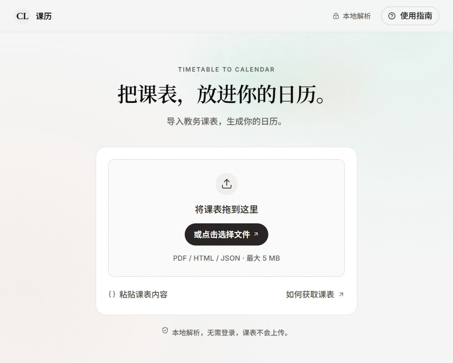
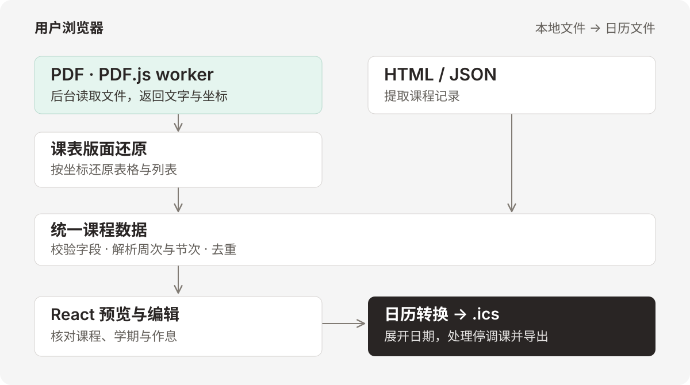

<p align="center">
  
</p>

<h1 align="center">课历 · Timetable2Calendar</h1>

<p align="center">把教务课表转换为日历。导入文件，核对时间，下载 <code>.ics</code>。</p>

<p align="center">
  <a href="https://t2c.leojellyfish.cn/"><strong>打开课历 ↗</strong></a> ·
  <a href="#开始使用">使用方法</a> ·
  <a href="#架构">架构</a> ·
  <a href="#部署">部署</a> ·
  <a href="LICENSE">MIT License</a>
</p>

<p align="center">
  <a href="https://t2c.leojellyfish.cn/"></a>
</p>

课历适配**中央财经大学正方教务系统**。支持教务课表的文字版 PDF、Ctrl + S 保存的 HTML 网页，以及课历 JSON 备份。无需提供教务账号，课表内容不会上传。

| 导入与识别 | 核对与导出 |
| --- | --- |
| 表格 / 列表 PDF，支持跨页和旋转页面 | 周课表与课程列表，可搜索和编辑 |
| Ctrl + S 保存的 HTML 网页、JSON 课表备份 | 自行设置第 1 周周一和每日作息 |
| 单双周、不连续周次和分段授课 | 整日停课、调课与时间冲突提示 |
| 合并单元格、分段教师和重复记录去重 | 选择导出课程，设置备注格式与提醒 |

## 开始使用

1. **获取课表。** 通过课历「使用指南」中的「打开教务课表」链接进入教务系统，选择学年与学期。导出文字版 PDF，或在「表格」视图等课程显示完整后，按 Ctrl + S 保存为「网页，全部」或「网页，仅 HTML」。已有课历 JSON 备份也可直接导入。
2. **导入并核对。** 在 [课历](https://t2c.leojellyfish.cn/) 选择或拖入文件；HTML 和 JSON 也可直接粘贴。在「学期与时间」设置第 1 周周一，核对作息，再检查课程和停调课安排。
3. **导出日历。** 选择需要的课程，下载 `.ics`，导入 Apple 日历、Google 日历或 Outlook。

单个文件最大 **5 MB**，PDF 最多 **50 页**。请使用含文字的教务课表 PDF，扫描件和截图暂不支持。

> 课表仅保存在当前页面内存中，刷新或关闭页面会清空。离开前可保存课程 JSON；备份包含课程，不包含学期设置、提醒、勾选状态和停调课规则。

<details>
<summary>导入规则与日历客户端说明</summary>

保存网页后，只需导入 `.html` 或 `.htm` 文件，旁边的资源文件夹无需导入。若保存的网页没有课程内容，请重新查询后保存，或改用 PDF。JSON 备份可通过课表页底部的「保存课程数据」下载，文件名为 `timetable-backup.json`。

导入成功会替换当前课程并清空停调课规则；导入失败保留原课表。待筛选课程默认不选入导出，无法解析的记录和时间冲突会显示提示。

Apple 日历可打开 `.ics` 文件；Google 日历网页版通过「设置 → 导入和导出」导入；Outlook 通过「添加日历 → 从文件上传」导入。建议建立独立的课表日历，更新时替换旧课表，避免重复导入。各客户端的提醒、颜色和重复导入行为可能不同，尚未逐一实测。

</details>

## 架构

项目采用 **React + TypeScript 的纯前端单页应用架构**。Vite 将源码构建为静态文件，EdgeOne 分发 HTML、CSS 和 JavaScript。文件解析与日历生成都在用户浏览器里完成，无需后端服务或数据库；Node.js 仅用于开发和构建。

<p align="center">
  
</p>

### 从文件到日历

| 模块 | 对应源码与职责 |
| --- | --- |
| 导入入口 | [ImportPanel.tsx](src/components/ImportPanel.tsx) 读取本地文件，仅在导入 PDF 时加载 PDF 解析模块。 |
| PDF 读取 | [pdf.ts](src/lib/pdf.ts) 配置资源；[pdf-reader.ts](src/lib/pdf-reader.ts) 调用 PDF.js，逐页取得文字及坐标，并控制页数和超时。 |
| 课表提取 | [pdf-layout.ts](src/lib/pdf-layout.ts) 按文字位置还原表格或列表；[extract.js](src/lib/extract.js) 从保存的 HTML 中收集课程记录。 |
| 数据校验 | [parser.ts](src/lib/parser.ts) 将导入记录整理为统一的 `Course` 数据，解析周次与节次，校验字段并去重。 |
| 页面状态 | [App.tsx](src/App.tsx) 使用 React 状态管理当前课程与设置，连接预览、编辑和导出流程。 |
| 日历生成 | [calendar.ts](src/lib/calendar.ts) 将课程展开为每次授课，处理停调课、检测冲突并生成 ICS；[download.ts](src/lib/download.ts) 触发本地下载。 |

例如，一门课安排在「周一第 7–8 节，1–16 周」，日历模块会结合第 1 周周一和作息设置，算出每次授课的日期与起止时间，再应用停调课规则。

### PDF worker 做什么

PDF.js worker 在浏览器的后台线程中解析 PDF，处理文件结构与文字编码，将读取结果传回页面。把这部分工作放到后台，可以减少解析文件时的界面卡顿。worker 程序从站点加载，用户选择的 PDF 内容留在设备上。

课程识别由项目自己的版面解析器完成。它根据文字及坐标还原课表，从中识别课程名、周次与节次等字段，再交给统一校验流程。**目前读取 PDF 中已有的文字，没有 OCR。** 课表版面识别和日历生成在页面主线程中执行。

PDF.js 所需的 worker、CMap 和标准字体随站点一起部署，不依赖外部 PDF 服务。启动开发服务器或构建时，[prepare-pdf-assets.mjs](scripts/prepare-pdf-assets.mjs) 会准备辅助资源。

<details>
<summary>目录与技术栈</summary>

```text
src/
  components/       导入、课表、设置、课程编辑与弹窗
  lib/
    parser.ts       课程规范化与校验
    extract.js      从保存的 HTML 中收集课程记录
    pdf*.ts         PDF.js 读取与表格 / 列表版面还原
    calendar.ts     日期展开、停调课、冲突及 ICS
    settings.ts     默认作息与 JSON 备份格式
  styles.css        界面与响应式样式
public/fonts/       本地字体及许可证
assets/readme/      README 截图与架构图
scripts/            构建前准备 PDF 资源
tests/              自动化测试与虚构样本
```

界面使用 React、TypeScript 和 Lucide；HTML 解析使用 linkedom，PDF 读取使用 PDF.js。Vite 负责构建，Vitest 运行测试，ical.js 用于回读导出的日历。

界面参考 LightMuse 的暖灰、衬线标题与胶囊按钮风格，字体和资源已独立放入本项目。默认首页只显示导入入口，导入后展示课程统计、设置和预览；支持手机布局。

</details>

## 日历格式

每次授课生成一个独立事件，不连续节次会拆分为独立日程。

| 内容 | 简洁格式（默认） | 详细格式 |
| --- | --- | --- |
| 标题 | 课程名 | 课程名 |
| 地点 | 教室，移除独立校区前缀 | 完整校区和教室 |
| 备注 | 教师 | 教师、周次、节次、教学班及备注 |

两种格式都保留调课和待筛选提示。默认不提醒，可选择上课时或提前提醒。文件包含 `Asia/Shanghai` 时区定义和稳定 UID，采用 UTF-8 折行，并附带橙色日历元数据；客户端决定是否采用颜色。

默认 13 节作息依据《中央财经大学关于调整学校教学作息时间的通知》（校发〔2019〕5 号），每节 45 分钟，可在界面中逐项修改。支持的学期日期为 2000–2099 年，初始日期仅为可修改的起点，请以每学期校历为准。

## 本地开发

需要 **Node.js 22.12+** 和 npm。

```sh
git clone https://github.com/LeoAndJellyfish/Timetable2Calendar.git
cd Timetable2Calendar
npm ci
npm run dev
```

打开 [http://127.0.0.1:5173](http://127.0.0.1:5173)。开发与预览服务器默认只监听本机。

| 命令 | 用途 |
| --- | --- |
| `npm test` | 运行测试 |
| `npm run build` | 类型检查并生成 `dist/` |
| `npm run check` | 运行测试与生产构建 |
| `npm run preview` | 在 `127.0.0.1:4173` 预览 `dist/` |

<details>
<summary>测试覆盖与可选 PDF 样本</summary>

52 项常规测试检查 HTML / JSON 提取与 PDF 版面解析，涵盖分段与单双周、异常输入，以及停调课和冲突处理；也检查时区和 ICS 规范，使用独立的 `ical.js` 回读日历。构建回归测试检查 PDF worker 的输出扩展名、内容与引用。

另有 2 项可选本地集成测试：设置 `PDF_SAMPLE_FILES`（两份匹配样本路径组成的 JSON 数组），以及可选的 `CALENDAR_REFERENCE_FILE`（参考 ICS 路径）。这些测试面向开发时使用的固定样本，校验两种 PDF 布局结果一致及 188 个日程字段匹配；未提供文件时自动跳过。个人样本不会提交到仓库。

</details>

## 部署

运行 `npm run build`，将完整的 **`dist/`** 部署到支持 HTTPS 的静态网站主机根路径。正式站使用 [t2c.leojellyfish.cn](https://t2c.leojellyfish.cn/)。

EdgeOne 配置如下。

| 配置项 | 值 |
| --- | --- |
| 构建命令 | `npm run build` |
| 输出目录 | `dist` |

请保留构建产物中的 PDF worker、CMap、标准字体及许可证。当前资源使用根路径；部署到子目录时，需要同时调整 Vite `base`、字体地址和 PDF 资源地址。

### PDF worker 加载失败

项目将 PDF worker 输出为带哈希的 `.js` 文件，模块内容与 PDF.js 原文件一致。这可以兼容部分静态主机：它们将 `.mjs` 返回为 `application/octet-stream`，导致浏览器拒绝执行模块。

出现 `Setting up fake worker failed` 时，在浏览器 Network 中检查 worker 请求。

| 响应 | 检查方向 |
| --- | --- |
| `200`，类型为 `text/javascript` 或 `application/javascript` | worker 资源的状态码与类型正常 |
| `401` / `403` | 检查访问验证；临时预览域名可能需要完整验证链接 |
| `404`，或内容为 HTML | 检查构建产物、部署目录与重写规则 |
| 类型为 `application/octet-stream` | 检查扩展名与静态资源类型配置 |

绑定自定义域名不能替代正确的资源类型配置。更新版本后请重新部署完整构建，并刷新已打开的页面，以加载新的 worker 地址。

## 数据与限制

- **本地处理。** 没有课表上传接口、账号托管、分析统计或外部字体 CDN。导入后仅保留课程字段，不收集学号、密码或 Cookie。
- **HTML 隔离解析。** 导入的 HTML 在独立解析器中处理，不执行脚本、不加载资源、不插入页面 DOM。
- **适配范围。** 暂不支持扫描件 / 截图 OCR、加密 PDF、任意学校自动识别或自动节假日推断。教务系统调整格式后可能需要更新适配器。
- **文件导出。** 当前提供 `.ics` 下载，暂不提供订阅地址或持续同步。

## 参考与许可

- [WakeupSchedule_Kotlin](https://github.com/tKM9WsmQUaUgNttn3DGUsHkxG8/WakeupSchedule_Kotlin)：参考网页导入与课程数据分离的思路，未复制其源码。
- [中财教务课表](https://xuanke.cufe.edu.cn/jwglxt/kbcx/xskbcx_cxXskbcxIndex.html?gnmkdm=N2151&layout=default)：当前适配目标。本项目为独立工具，非学校官方产品。
- [iCalendar · RFC 5545](https://www.rfc-editor.org/rfc/rfc5545)：日历文件格式。

本项目源码采用 [MIT License](LICENSE)。字体及第三方依赖保留各自许可证，见 [THIRD_PARTY_NOTICES.md](THIRD_PARTY_NOTICES.md)。
